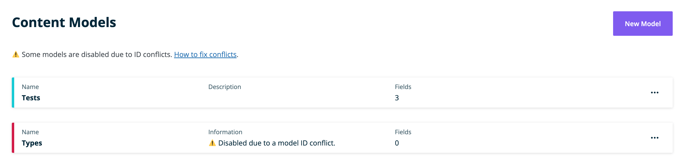
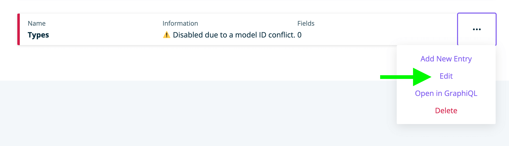
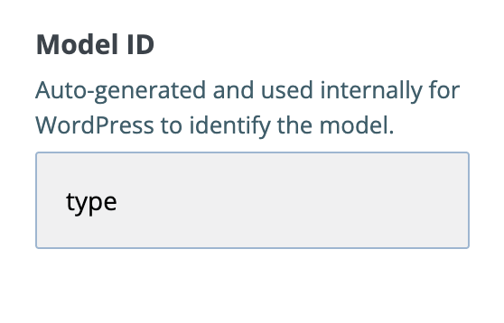

# Model ID Conflicts

**Atlas Content Modeler now disables models with IDs that conflict with reserved post type names from WordPress Core.** This prevents fatal errors and other unexpected behavior.

Disabled models display a message on the Models index:



## How to fix model ID conflicts

Change conflicting model IDs to use a new ID with [WP-CLI](../wp-cli/index.md). This process also migrates posts and taxonomies related to the model.

1. Back up your WordPress site.

2. If you have custom code that references the conflicting model by its ID (such as REST requests URLs), update it to work with the new model name you plan to use.

3. Find the model ID of the conflicting model by choosing Edit from the Model options:

    

    

4. Run this command in WP-CLI to migrate your current model ID to a new ID:

    ```
    wp acm model change-id [oldid] [newid]
    ```

    The newid must not exceed 20 characters and should only contain lowercase alphanumeric characters, dashes and underscores. Other characters will be removed.

    For example, if your current model ID is 'type', you can change it to 'example-type' with this command:

    ```
    wp acm model migrate-id type example-type
    ```

5. Refresh the Content Model index page in WordPress. You should no longer see a conflict for that model and it will be enabled again.

## Why is this happening now?

Previous versions of ACM did not prevent special names reserved by WordPress from being used as model IDs.

Registering custom post types with reserved names such as 'type' can result in [fatal errors when creating new posts and pages](https://github.com/wpengine/atlas-content-modeler/issues/613) and other bad side-effects.

ACM now prevents new models from using reserved names. Historic models with ID conflicts need to be migrated manually to keep your site running smoothly.

## How to get help

[Open a discussion in the ACM GitHub repository](https://github.com/wpengine/atlas-content-modeler/discussions/new) if you need further help.
