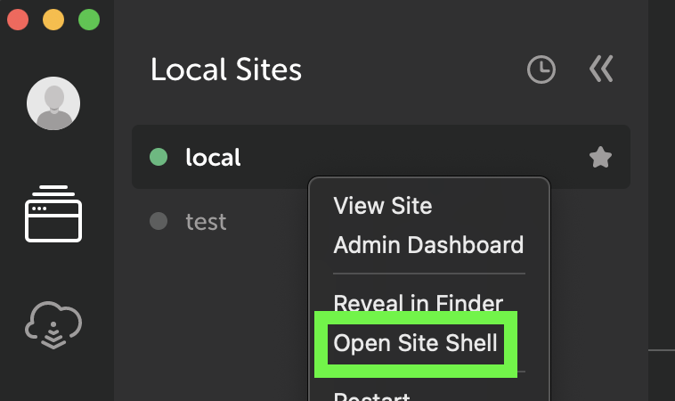

# Atlas Content Modeler WP-CLI Commands

ACM provides the [WP-CLI](https://wp-cli.org/) commands below. WP-CLI lets you run commands in your terminal to automate development processes that would take more time and effort to do manually.

We recommend [Local](https://localwp.com/) for a local WordPress development environment that includes WP-CLI. Choose “Open Site Shell” from the site contextual menu, then try typing the commands below.



All ACM WP-CLI commands return 0 on success and 1 on failure. Success messages are prefixed by “Success:” and failure messages by “Error:”.

## wp acm blueprint import

Requires: ACM 0.14.0+.

### Description

Imports an ACM blueprint from a URL or File Path.

### Synopsis

```
wp acm blueprint import <path>
```

### Options

`<path>`
The URL or local path of the blueprint zip file, or local path to the blueprint folder containing the acm.json manifest file. Local paths must be absolute.

### Examples

```
wp acm blueprint import https://example.com/path/to/blueprint.zip
wp acm blueprint import /local/path/to/blueprint.zip
wp acm blueprint import /local/path/to/blueprint-folder/
```

ACM also includes a bundled 'demo' blueprint for developers to use when exploring and testing ACM. Learn [how to import demo content](https://github.com/wpengine/atlas-content-modeler/blob/main/docs/wp-cli/demo-content.md).

## wp acm blueprint export

Requires: ACM 0.14.0+.

### Description

Exports an ACM blueprint using the current state of the site.

### Synopsis

```
wp acm blueprint export [--name] [--description] [--min-wp] [--min-acm] [--version] [--post-types] [--open]
```

`[--name]`
Optional blueprint name. Used in the manifest and zip file name.
Defaults to “ACM Blueprint” resulting in acm-blueprint.zip.

`[--description]`
Optional description of the blueprint.

`[--min-wp]`
Minimum WordPress version. Defaults to current WordPress version.

`[--min-acm]`
Minimum Atlas Content Modeler plugin version. Defaults to current
ACM version.

`[--version]`
Optional blueprint version. Defaults to 1.0.

`[--post-types]`
Post types to collect posts for, separated by commas. Defaults to post,
page and all registered ACM post types.

`[--wp-options]`
Named wp_options keys to export, separated by commas. Empty by default.

`[--open]`
Open the folder containing the generated zip on success (macOS only,
requires that `shell_exec()` has not been disabled).
