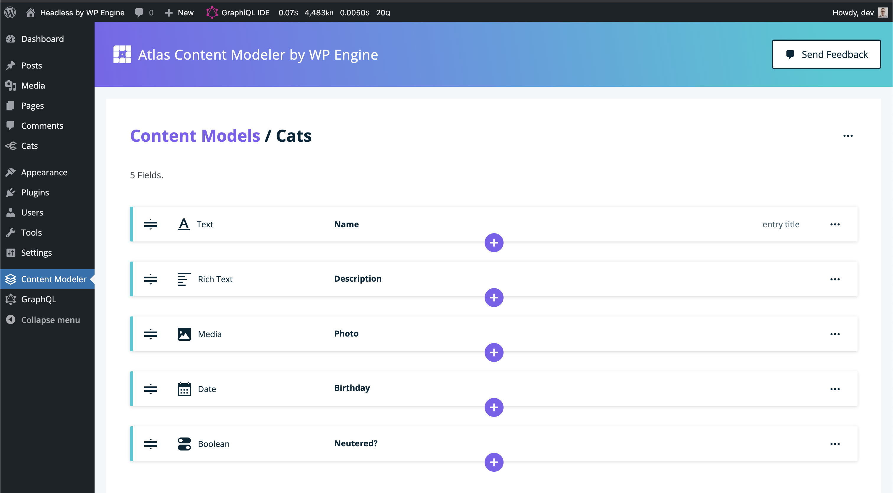

# Atlas Content Modeler by WP Engine

**IMPORTANT:** Atlas Content Modeler is entering an end-of-life phase. During this phase, we will continue to support Atlas Content Modeler to ensure it is secure and functional, giving you time to move your site to our recommended replacement. While security and critical bug fixes will continue to be provided through 2024, no new feature development will happen in Atlas Content Modeler. The plugin will be shutdown in early 2025.

We recommend Advanced Custom Fields (ACF) as a replacement for Atlas Content Modeler. ACF is a mature and stable product, with a large community, and it has most of the features that Atlas Content Modeler has, and more!

Read more about ACM's deprecation and how to migrate your site to ACF [here](./docs/end-of-life/index.md).

---

Atlas Content Modeler is a WordPress plugin to create custom post types and fields for headless WordPress sites.

[Download the latest plugin zip file](https://downloads.wordpress.org/plugin/atlas-content-modeler.latest-stable.zip).

---



---

## For developers

Developers get a modern content modeling system with WPGraphQL and REST support.

## For publishers

Publishers get friendly and familiar content entry pages.

## Requirements

- WordPress 5.7 or higher.
- PHP 7.2 or higher.
- We recommend that you set Permalinks to a value other than “Plain” in your WordPress dashboard at Settings → Permalinks.

## Setup

1. [Download the latest copy of the Atlas Content Modeler plugin here](https://downloads.wordpress.org/plugin/atlas-content-modeler.latest-stable.zip).
2. Install and activate the plugin in your WordPress admin area at Plugins → Add New by clicking “Upload Plugin”.
3. We recommend that developers also install and activate the [WPGraphQL plugin](https://wordpress.org/plugins/wp-graphql/) to be able to fetch model entries with GraphQL.

Once installed, Atlas Content Modeler and WPGraphQL check for updates and display prompts to install new versions.

## Quick start

Atlas Content Modeler has a three-step workflow:

1. Developers create a content model and its fields.
2. Publishers add entries for that model.
3. Developers fetch entry data with WPGraphQL or REST to display in their website or application.

### Create a content model

1. Click “Content Modeler” in your WordPress admin sidebar.
2. Click “Get Started” to add your first model.
3. Type “Cat” as the singular name, “Cats” as the plural name and set “API Visibility” to “Public”. Optionally type a description.
4. Click “Create”.

You will see “The Cats model was created”. Now you're ready to add your first field.

### Add fields to your model

1. Click the “Text” button to add a text field.
2. Type “Name” into the name field so that publishers will be able to give their cats a name.
3. Tick “Use this field as the entry title”.
4. Click “Create”.

Let's add one more field so that publishers can add an image of their cats.

1. Click the purple “+” button below the Name field you just added.
2. Click the “Media” button.
3. Type “Photo” into the name field.
4. Click “Create”.

Nice work! You defined your first model and added two fields. It's time to add your first cat entry.

### Add entries

1. Click the “Cats” menu item in the WordPress admin sidebar.
2. Click “Add New”.
3. Give your cat a name and add a photo.
4. Click “Publish”.

You defined a cat model and added your first cat entry. That's everything you need to be able to fetch cats using a GraphQL or REST request.

### Fetch content

Atlas Content Modeler is designed for headless WordPress, where a developer creates an app or website to display custom content. Developers can fetch content with GraphQL or REST:

#### Fetch content with GraphQL
Install and activate the [WPGraphQL plugin](https://wordpress.org/plugins/wp-graphql/) to follow along with this example.

1. Click “Content Modeler” in your WordPress admin sidebar.
2. Click the options button (three dots) on the right of the “Cats” row in the list of models.
3. Click “Open in GraphiQL”. GraphiQL will load with a pre-filled query for your cats data.
4. Click the Play button at the top of GraphiQL. The response will include the name and image information for the cat you added.

#### Fetch content with REST
Visit `https://example.com/wp-json/wp/v2/cats` in your browser, replacing `https://example.com` with your WordPress URL.

You will see model data for your cats. Atlas Content Model fields appear in the `acm_fields` property:

```json
[
	{
		"acm_fields": {
			"name": "Garfield",
			"photo": {}
		}
	}
]
```

#### Authenticate requests for private models
Models with a “Private” API Visibility need authenticated GraphQL and REST requests. [Learn about authentication options](https://www.wpgraphql.com/docs/authentication-and-authorization/) from the WPGraphQL documentation.

Change the API Visibility of a model at any time by choosing “Edit” from the model options.

Requests sent in a GraphiQL session in the WordPress admin area are authenticated by default. This makes GraphiQL a good place to experiment with queries for private model data.

## Next steps
- Learn more by [reading the documentation](https://developers.wpengine.com/docs/atlas-content-modeler).
- Click ”Send Feedback” at the top of the Content Modeler page in your WordPress admin area to share your thoughts with us.
- [File bugs or feature requests](https://github.com/wpengine/atlas-content-modeler/issues/new/choose) in GitHub.
- Create a headless WordPress site using [Faust.js](https://github.com/wpengine/faustjs) by WP Engine.
- Discover the [Atlas headless WordPress hosting platform](https://wpengine.com/atlas) by WP Engine.
- Watch a video introducing the [WordPress REST API](https://www.youtube.com/watch?v=uJf-fu3VbKw).
- Watch a video introducing [WPGraphQL](https://www.youtube.com/watch?v=N7H-a1232ow).
